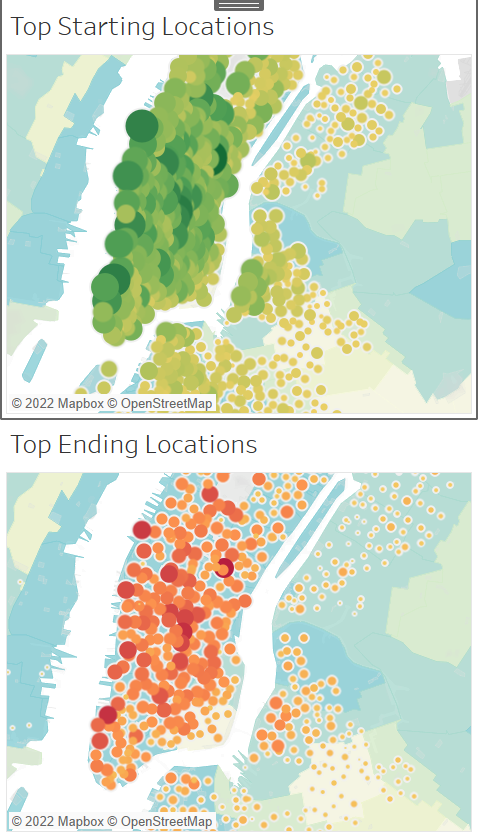

# BikeSharing

## Overview
This project is a visual analysis of New York CitiBike data using Tableau.

## Results
[NYC CitiBike Analysis Dashboard](https://public.tableau.com/app/profile/sarah.crozier/viz/CitiBikeAnalysis_16574831408340/NYCCitiBikeStory?publish=yes)

* Riders increase useage inyounger users.
* Male riders make us the majority of users.

* Onces again we see the data shows male users tend to ride before and after work hours and on the weekends.

* The data shows higher useage bin the morning and afternoon hours.

* Short use trips of less than an hour are the predominate use, regardless of gender. 

* Male subscribers to the CitiBike system make us the majority of users. 

* Most of the travel and usage is in the main city area.

## Summary
* The data indicates, that men who are subscribers use bike sharing before and after work hours. 
* The CitiBike usage may be attributed to an alternative to public transportation. 

## Reccomendations 
* Advertising and marketing should focus on male clients. Creating business partnerships that allow workers to commute via bike, could build cliental. 

* In lower use times offering reduced fares could increase ridership. 

* To expand the data to other cities, corralating public transportation data would be useful to see where current public transportation gaps may exist. 